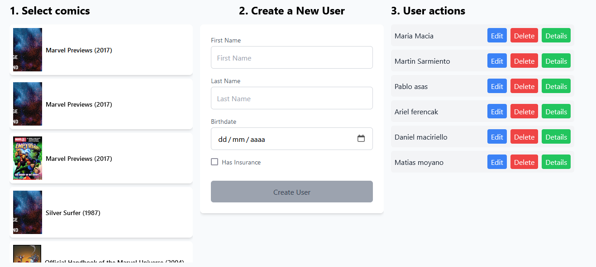

# Uteam Technical Test - Vue Application

This application is designed for the Uteam technical test. It allows users to create profiles by filling out a form and selecting their favorite comics. These selections can be viewed in a list, where users can perform actions such as updating, deleting, or viewing more details about each comic.

## Screenshots

Image 01 -   
Image 02 -   
Image 03 - 

## Project Setup

To install the project dependencies, run the following command:

```sh
npm install

```

### Compile and Hot-Reload for Development

```sh
npm run dev
```
